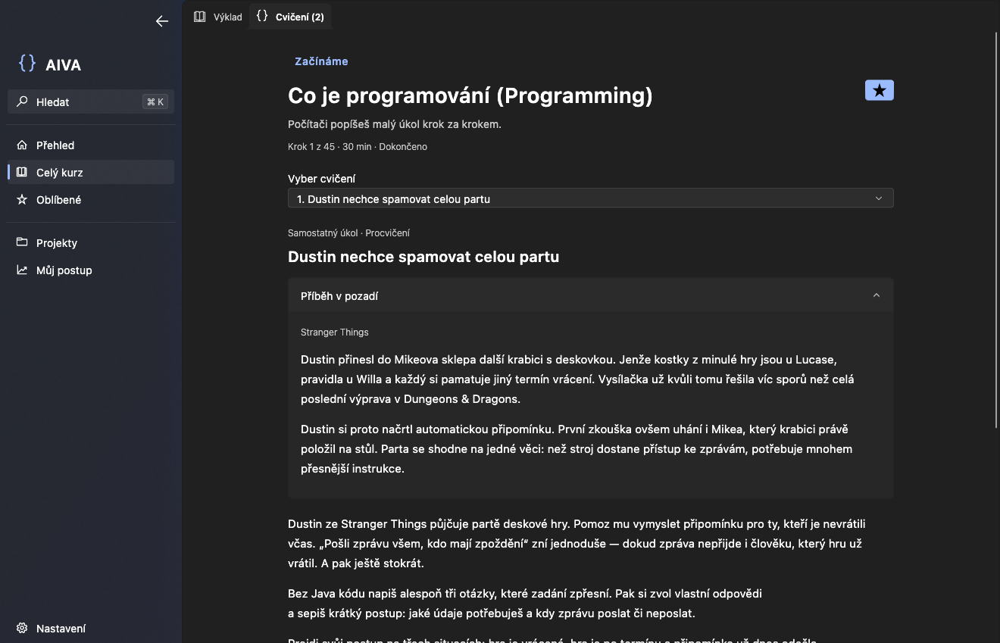

# AIVA

I promised my friends at university an easy way to learn Java, so I built AIVA around a curriculum similar to an introductory university Java course. It works offline, uses the `fluent_ui` library, and has a handmade Acrylic-inspired effect in the navigation pane. The source code and course content are open source under the [MIT License](LICENSE).

## A look inside

## Features

- Displays lessons, code examples, common mistakes, and exercises in a Czech interface on macOS, Windows, and Linux. The course works offline.
- Includes 78 lessons, 171 exercises, and six projects. It stores completed lessons and exercises, favorites, and reading position in a local SQLite profile.
- Searches lesson titles, content, and topics in Czech and English. Search is case- and accent-insensitive.
- Prepares a working copy of exercise files and opens it in IntelliJ IDEA or VS Code. Subsequent preparation preserves changes in an existing workspace.
- Checks selected solutions against the expected output using a local JDK 21 or later. Other exercises use the checklist provided in the instructions. Projects using Maven, Gradle, or JUnit are run in an external IDE or terminal.
- Supports backing up and restoring the profile, including learning progress.

## Course coverage

The course has 45 lessons on the core path and 33 optional lessons. It covers:

- programming fundamentals, Java syntax, variables, types, operators, input and output, conditionals, loops, methods, and arrays;
- classes and objects, constructors, references and `null`, encapsulation, inheritance, polymorphism, interfaces, enums, and generics;
- collections, object equality, exceptions, dates and times, file handling, and numeric precision;
- JUnit testing, TDD, and test doubles; building projects with Maven and Gradle; Git, GitHub and GitLab collaboration, and application structure;
- optional topics including JSON, XML, YAML, lambda expressions, the Stream API, regular expressions, HTTP and APIs, SQL and JDBC, concurrency, debugging, and other advanced subjects.
